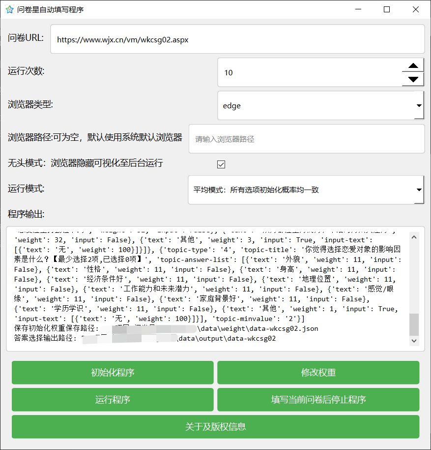
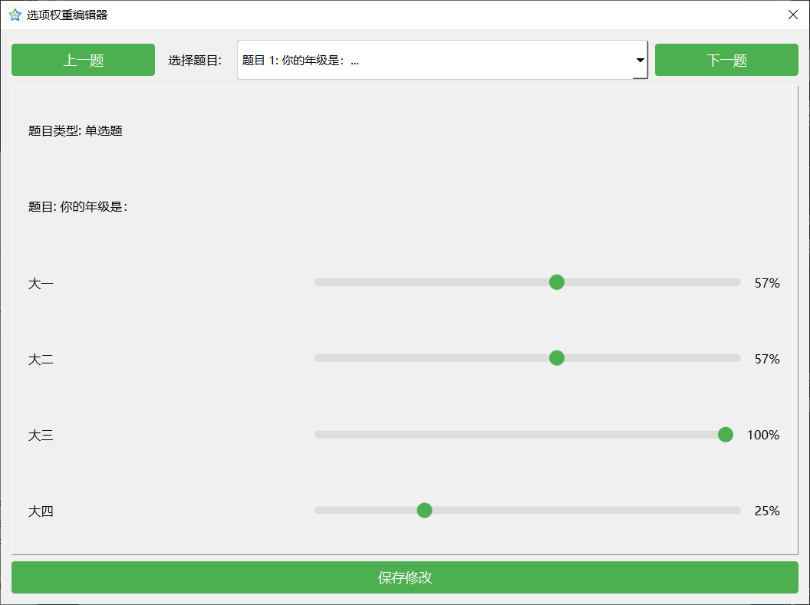
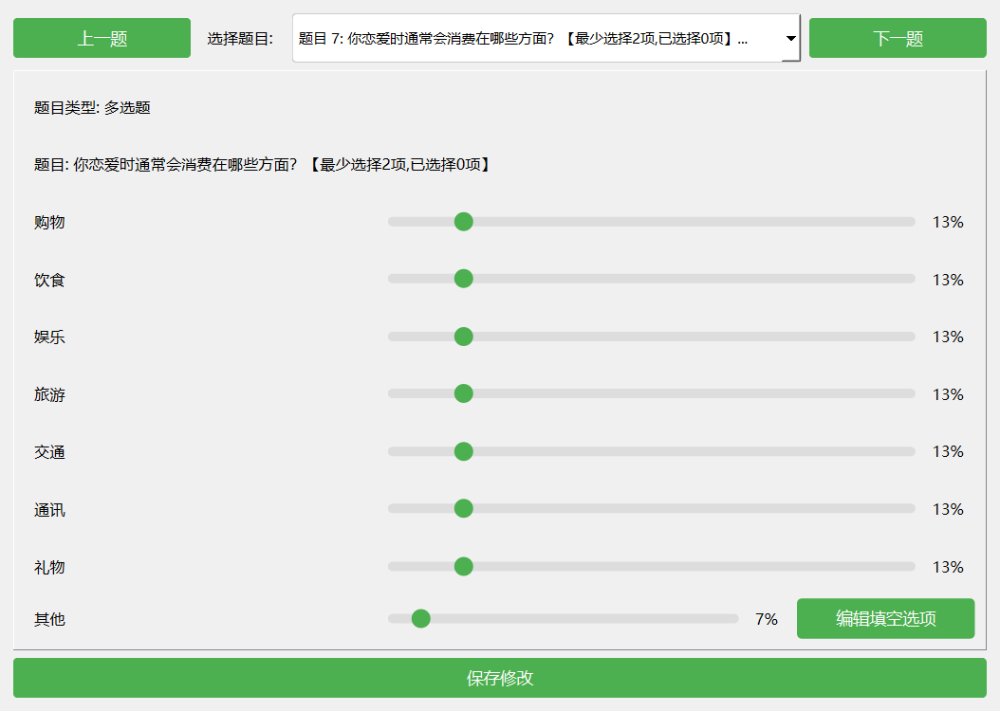
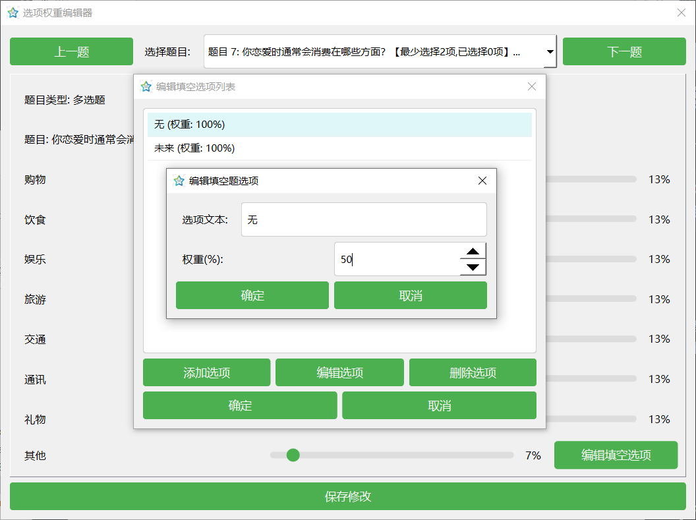
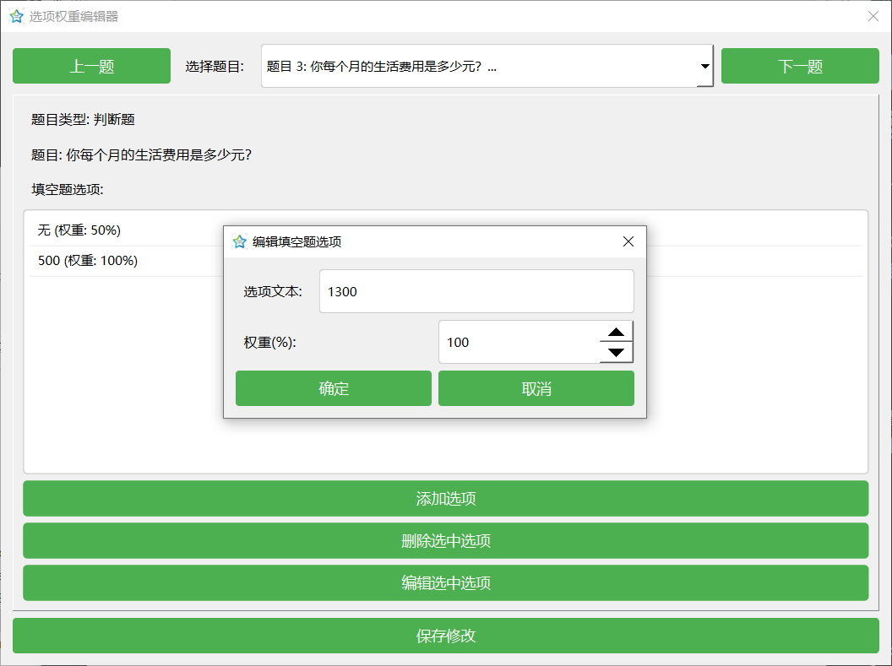

# 问卷星自动填写程序

> **⚠️ 重要声明**  
> 本项目采用 [GPL 开源协议](LICENSE)，**请勿以任何形式贩卖**。所有衍生作品必须同样开源。

## 功能简介

这是一个基于Python、DrissionPage的问卷星自动填写程序,主要功能包括:

1. 自动初始化问卷数据
2. 支持设置选项权重并按照设置权重随机填写问卷
3. 支持单选、多选中填空以及填空题
4. 支持填空自定义答案
5. 记录填写结果
6. 后台自动填写，1小时可填写300份左右问卷

**最新软件包下载地址：https://github.com/666cy666/AutoQuest/releases/download/AutoQuest/AutoQuestV1.3.zip**

**github项目地址：https://github.com/666cy666/AutoQuest**

## 使用说明

###  环境要求
**软件包环境**

- 操作系统: Windows 10
- 浏览器: Chrome/Edge

**源代码环境**

- Python 3.10
- Chrome/Edge浏览器
- 相关Python依赖包:
  - requirements.txt

### 使用步骤

1. **初始化问卷**
   - 填写问卷地址   

   - 点击"初始化程序"按钮
   
   - 程序会自动获取问卷题目和选项信息
   
   - 生成初始权重配置文件
   

2. **修改权重**

点击"修改权重"按钮，根据需要调整各选项的选择概率，权重范围为0-100

- **单选和多选权重选择**

- **单选和多选带填空**
  

  点击编辑填空选项时可增删改选项，同时可修改权重

- 填空题

3. **开始填写**
   - 设置填写次数
   
   - 点击"开始程序"按钮

   - 程序会自动根据权重随机选择答案

4. **终止程序**
   - 点击"重启以中止程序"按钮
   - 程序会在填写下一次问卷时终止任务

### 输出说明

程序运行后会生成以下文件:

- `data/weight/data-{问卷ID}.json`: 问卷配置和权重数据
- `data/output/data-{问卷ID}/answer_records_{次数}.json`: 填写记录
- `data/logs/log.txt`: 运行日志

## 注意事项

1. 使用前请确保网络连接正常
2. 建议不要过于频繁填写同一问卷（同一ip频繁填写同一问卷会被检测，由正常5-8s一张问卷变为10-15s一张问卷）
3. 部分特殊类型题目可能不支持
4. 如遇到验证码等安全措施可能无法完成填写（已支持滑动验证码验证，其余验证码暂时没有遇到）
5. 程序运行时请勿关闭浏览器

## 常见问题

1. **程序无法终止(V1.3版本已解决)**
   - 打包环境下存在bug，源代码环境下可正常终止
   - 请点击终止后手动重启脚本

2. **填写失败**
   - 检查网络连接
   - 确认问卷地址是否有效
   - 查看是否触发问卷星安全机制

3. **权重设置无效**
   - 确认权重文件格式正确
   - 检查权重值是否在有效范围内

## 支持开发者
- 本项目完全免费，如果您想支持后续开发，可通过扫码赞助

