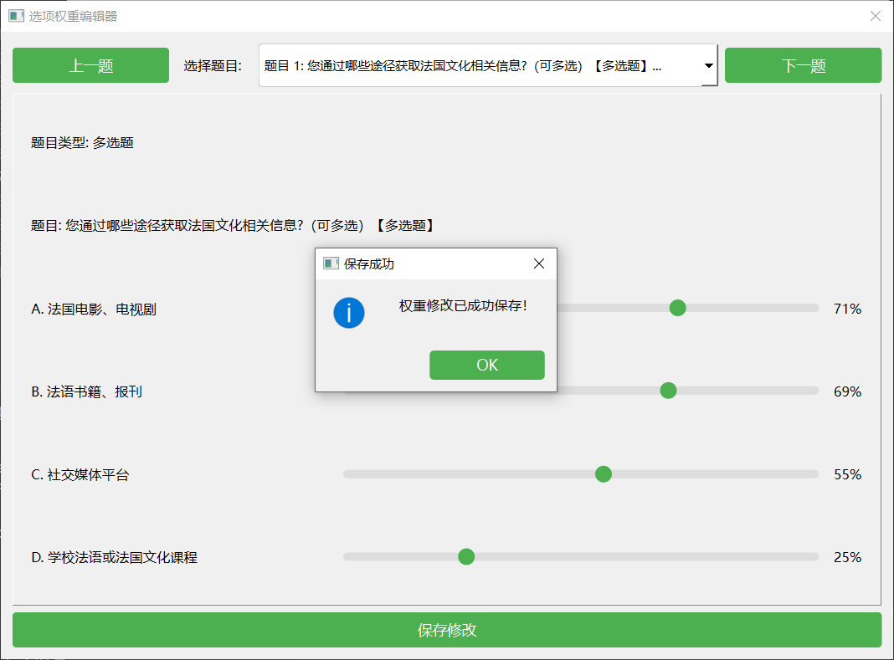
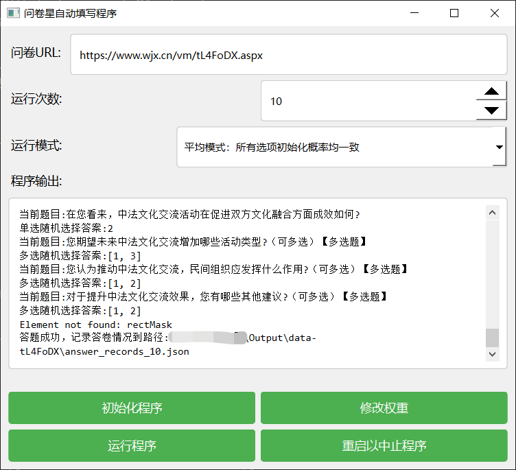

# 问卷星自动填写程序

## 功能简介

这是一个基于Python的问卷星自动填写程序,主要功能包括:

1. 自动初始化问卷数据
2. 支持设置选项权重
3. 自动按照设置权重随机填写问卷
4. 记录填写结果
5. 支持单选题和多选题
6. 支持填空题

**软件包下载地址：https://github.com/666cy666/AutoQuest/releases/download/AutoQuest/AutoQuestV1.0.zip**

**github项目地址：https://github.com/666cy666/AutoQuest**

## 使用说明

### 1. 环境要求
**软件包环境**

- 操作系统: Windows 10
- 浏览器: Chrome/Edge

**源代码环境**

- Python 3.10
- Chrome/Edge浏览器
- 相关Python依赖包:
  - requirements.txt

### 2. 配置说明

程序配置文件位于`Config/setting.json`:

```json
{
    "url": "问卷地址",
	"count": "填写次数",
	"mode": {
		"mode-type": "other-mode",
		"average-mode": "平均模式：所有选项初始化概率均一致",
		"other-mode": "其他模式：对于'其他'选项概率为1-5%"
	}
}
```

### 3. 使用步骤

1. **初始化问卷**
  
   - 点击"初始化程序"按钮
   
   - 程序会自动获取问卷题目和选项信息
   
   - 生成初始权重配置文件
   


2. **修改权重**
   - 点击"修改权重"按钮
   
   - 根据需要调整各选项的选择概率

   - 权重范围为0-100
   



3. **开始填写**
   - 设置填写次数
   
   - 点击"开始程序"按钮

   - 程序会自动根据权重随机选择答案
   



4. **终止程序**
   - 点击"重启以中止程序"按钮
   - 程序会自动终止并重启

### 4. 输出说明

程序运行后会生成以下文件:

- `Config/data-{问卷ID}.json`: 问卷配置和权重数据
- `Output/data-{问卷ID}/answer_records_{次数}.json`: 填写记录
- `Log/log.txt`: 运行日志

## 注意事项

1. 使用前请确保网络连接正常
2. 建议不要过于频繁填写同一问卷
3. 部分特殊类型题目可能不支持
4. 如遇到验证码等安全措施可能无法完成填写
5. 程序运行时请勿关闭浏览器

## 常见问题

1. **程序无法终止**
   - 打包环境下存在bug，源代码环境下可正常终止
   - 请点击终止后手动重启脚本

2. **填写失败**
   - 检查网络连接
   - 确认问卷地址是否有效
   - 查看是否触发问卷星安全机制

3. **权重设置无效**
   - 确认权重文件格式正确
   - 检查权重值是否在有效范围内

## 技术支持

如有问题请提交Issue或联系开发者。
